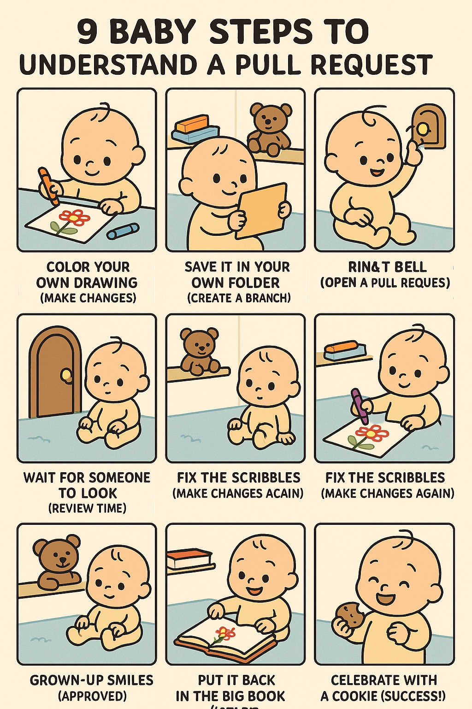

**Walkthrough of Two Codecademy Pull Requests**

**link to codecademy**

https://www.codecademy.com/courses/learn-github-best-practices/articles/how-to-write-a-good-pull-request

**link to youtube video**

https://www.youtube.com/watch?v=9EqP3GsE9N4

**link to the pull request in the video** 

*first*

https://github.com/Codecademy/docs/pull/384

*second* 

https://github.com/Codecademy/gamut/pull/1598

